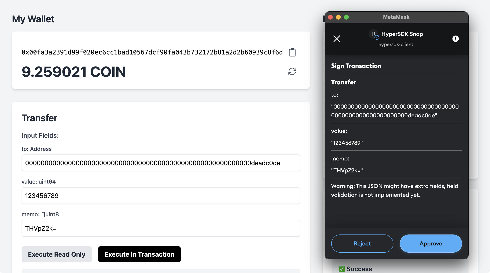

# HyperSDK Starter

## 0. Prerequisites
- Golang v1.22.5+
- NodeJS v20+
- Docker (Somewhat recent)
- Optional: [Metamask Flask](https://chromewebstore.google.com/detail/metamask-flask-developmen/ljfoeinjpaedjfecbmggjgodbgkmjkjk). Disable normal Metamask, Core wallet, and any other wallets. *Do not use your actual private key with Flask*.

## 0. Clone this repo
`git clone https://github.com/ava-labs/hypersdk-starter.git`

## 1. LKaunch Whole Stack

Run: `docker compose up -d --build devnet faucet frontend`. Might take 5 minutes to download dependencies.

For devcontainers or codespaces, forward ports 8765 for faucet, 9650 for the chain, and 5173 for the frontend.

Open [http://localhost:5173](http://localhost:5173) to see the frontend. Play around with it. Try both the Temporary key and Metamask snap (from npm, not local).

That's how it should look with Metamask Snap signing:



When finished, shut everything down with: `docker compose down`

## 2. Play around with the MorpheusVM
The VM included in this repo is a copy of [MorpheusVM](https://github.com/ava-labs/hypersdk/tree/main/examples/morpheusvm). MorpheusVM is a simpliest HyperSDK VM possible with only one action - Transfer.

### 2.1 Connect wallet

### 2.2 Call a read-only action

### 2.3 Issue a transaction

## 3. Add your own custom action

Think of actions in HyperSDK like functions in EVMs. They have inputs, outputs, and the execution logic. 

Below is the code of a `Greetings` action. The action does not change anything, only 

Put this into actions/greeting.go. The code has some comments, but for more information please explore [the docs folder in hypersdk](https://github.com/ava-labs/hypersdk/tree/main/docs).

```golang
package actions

import (
	"context"
	"fmt"
	"time"

	"github.com/ava-labs/avalanchego/ids"

	"github.com/ava-labs/hypersdk-starter/consts"
	"github.com/ava-labs/hypersdk-starter/storage"
	"github.com/ava-labs/hypersdk/chain"
	"github.com/ava-labs/hypersdk/codec"
	"github.com/ava-labs/hypersdk/state"
	"github.com/ava-labs/hypersdk/utils"
)

// Please see chain.Action interface description for more information
var _ chain.Action = (*Greeting)(nil)

// Action struct. All "serialize" marked fields will be saved on chain
type Greeting struct {
	Name string `serialize:"true" json:"name"`
}

// TypeID, has to be unique across all actions
func (*Greeting) GetTypeID() uint8 {
	return consts.HiID
}

// All database keys that could be touched during execution.
// Will fail if a key is missing or has wrong permissions
func (g *Greeting) StateKeys(actor codec.Address) state.Keys {
	return state.Keys{
		string(storage.BalanceKey(actor)): state.Read,
	}
}

// The "main" function of the action
func (g *Greeting) Execute(
	ctx context.Context,
	_ chain.Rules,
	mu state.Mutable, // That's how we read and write to the database
	timestamp int64, // Timestamp of the block or the time of simulation
	actor codec.Address, // Whoever signed the transaction, or a placeholder address in case of read-only action
	_ ids.ID, // actionID
) (codec.Typed, error) {
	balance, err := storage.GetBalance(ctx, mu, actor)
	if err != nil {
		return nil, err
	}
	currentTime := time.Now().Format("January 1")
	greeting := fmt.Sprintf(
		"Hi, dear %s! Today, %s, your balance is %s %s.",
		g.Name,
		currentTime,
		utils.FormatBalance(balance),
		consts.Symbol,
	)

	return &GreetingResult{
		Greeting: greeting,
	}, nil
}

// How many compute units to charge for executing this action. Can be dynamic based on the action.
func (*Greeting) ComputeUnits(chain.Rules) uint64 {
	return 1
}

// ValidRange is the timestamp range (in ms) that this [Action] is considered valid.
// -1 means no start/end
func (*Greeting) ValidRange(chain.Rules) (int64, int64) {
	return -1, -1
}

// Result of execution of greeting action
type GreetingResult struct {
	Greeting string `serialize:"true" json:"greeting"`
}

// Has to implement codec.Typed for on-chain serialization
var _ codec.Typed = (*GreetingResult)(nil)

// TypeID of the action result, could be the same as the action ID
func (g *GreetingResult) GetTypeID() uint8 {
	return consts.HiID
}
```

Now you have to make both VM and clients (via ABI) aware of the existance of this action. 

For that, you have to register your action in `vm/vm.go` after the `ActionParser.Register(&actions.Transfer{}, nil),` line:
```golang
ActionParser.Register(&actions.Greeting{}, nil),
```

And register it's output after the `OutputParser.Register(&actions.TransferResult{}, nil),` line:
```golang
OutputParser.Register(&actions.GreetingResult{}, nil),
```

## 4. Develop a Frontend
1. Bring down everything: `docker compose down`
2. Start only the devnet, and faucet: `docker compose up -d --build devnet faucet`
3. Navigate to the web wallet: `cd web_wallet`
4. Install dependencies and start the dev server: `npm i && npm run dev`

Ensure ports `8765` (faucet), `9650` (chain), and `5173` (frontend) are forwarded.

Please learn more on [npm:hypersdk-client](https://www.npmjs.com/package/hypersdk-client) and in the `web_wallet` folder of this repo.

## Notes
- You can launch everything without Docker:
  - Faucet: `go run ./cmd/faucet/`
  - Chain: `./scripts/run.sh`
  - Frontend: `npm run dev` in `web_wallet`
- Be aware of potential port conflicts if issues arise. `docker rm -f $(docker ps -a -q)` is your friend.
- For VM development you don't have to know Javascript - you can use an existing frontend container

