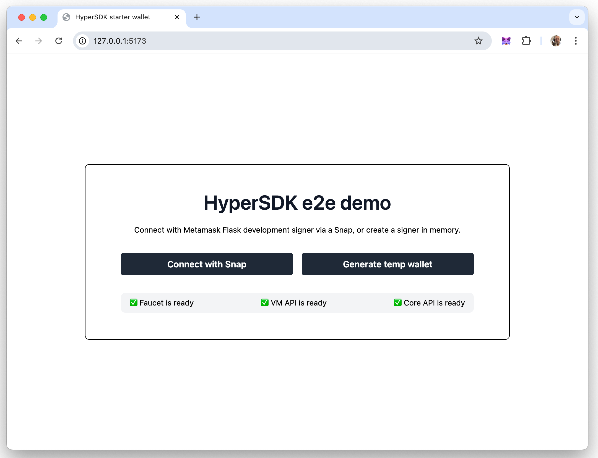
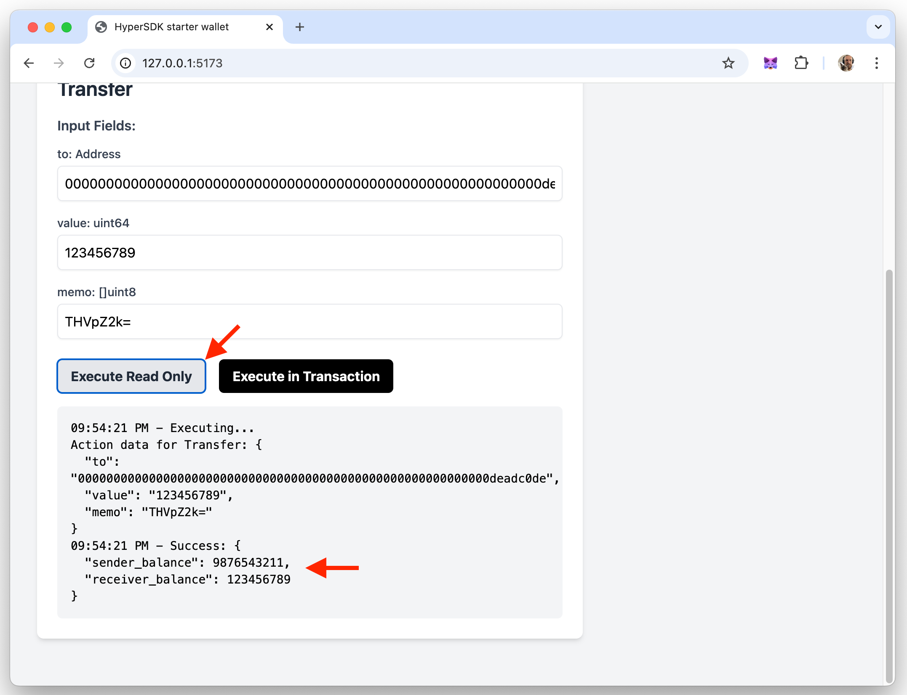

# HyperSDK Starter

## 0. Prerequisites
- Golang v1.22.5+
- NodeJS v20+
- Docker (Somewhat recent)
- Optional: [Metamask Flask](https://chromewebstore.google.com/detail/metamask-flask-developmen/ljfoeinjpaedjfecbmggjgodbgkmjkjk). Disable normal Metamask, Core wallet, and any other wallets. *Do not use your actual private key with Flask*.

## 0. Clone this repo
`git clone https://github.com/ava-labs/hypersdk-starter.git`

## 1. Launch this example

Run: `docker compose up -d --build devnet faucet frontend`. Might take 5 minutes to download dependencies.

For devcontainers or codespaces, forward ports `8765` for faucet, `9650` for the chain, and `5173` for the frontend.

When finished, shut everything down with: `docker compose down`

## 2. Play around with the MorpheusVM
This repo includes a copy of [MorpheusVM](https://github.com/ava-labs/hypersdk/tree/main/examples/morpheusvm), the simplest possible HyperSDK VM. It supports a single action (Transfer) for moving funds and tracking balances.

### 2.1 Connect wallet
Open [http://localhost:5173](http://localhost:5173) to see the frontend.




We recommend you using a Snap (requires [Metamask Flask](https://chromewebstore.google.com/detail/metamask-flask-developmen/ljfoeinjpaedjfecbmggjgodbgkmjkjk) installed) for the full UX, but a temporary wallet would work well enough too.

### 2.2 Execute a read-only action

Any action can be executed on-chain (in transaction) with the results persisted to a block of the chain, or off-chain, meaning read-only. As MorpheusVM has only one action, let's first try to execute it read-only. It shows expected balances of the sender and receiver. You can see the logic defined in `actions/transfer.go`.



### 2.3 Issue a transaction

Now let's write some data into the chain. Just click the "Execute in transaction" button, all the fields are already populated with sane defaults.


After being being mined, the transaction will appear in the right column. If you open another window and make a transaction there, it will still appear in the right column as it monitors all non-empty block on the chain.

### 2.4 Check logs

Logs are located inside docker container. So to see them you'll have to open a bash terminal inside the container into the foolder with the current network:
```bash
docker exec -it devnet bash -c "cd /root/.tmpnet/networks/latest_morpheusvm-e2e-tests && bash"
```

That is not perfect DevX and we are working on it.

## 3. Add your own custom action

Think of actions in HyperSDK like functions in EVMs. They have inputs, outputs, and the execution logic. 

Let's add the `Greeting` action. The action does not change anything, only prints your balance and the current date. But if it is executed in the transaction, the output will be recorded in a block on the chain. 

### 3.1 Create an action file

Put this into `actions/greeting.go`. The code has some comments, but for more information please explore [the docs folder in hypersdk](https://github.com/ava-labs/hypersdk/tree/main/docs).

```golang
package actions

import (
	"context"
	"fmt"
	"time"

	"github.com/ava-labs/avalanchego/ids"

	"github.com/ava-labs/hypersdk-starter/consts"
	"github.com/ava-labs/hypersdk-starter/storage"
	"github.com/ava-labs/hypersdk/chain"
	"github.com/ava-labs/hypersdk/codec"
	"github.com/ava-labs/hypersdk/state"
	"github.com/ava-labs/hypersdk/utils"
)

// Please see chain.Action interface description for more information
var _ chain.Action = (*Greeting)(nil)

// Action struct. All "serialize" marked fields will be saved on chain
type Greeting struct {
	Name string `serialize:"true" json:"name"`
}

// TypeID, has to be unique across all actions
func (*Greeting) GetTypeID() uint8 {
	return consts.HiID
}

// All database keys that could be touched during execution.
// Will fail if a key is missing or has wrong permissions
func (g *Greeting) StateKeys(actor codec.Address) state.Keys {
	return state.Keys{
		string(storage.BalanceKey(actor)): state.Read,
	}
}

// The "main" function of the action
func (g *Greeting) Execute(
	ctx context.Context,
	_ chain.Rules,
	mu state.Mutable, // That's how we read and write to the database
	timestamp int64, // Timestamp of the block or the time of simulation
	actor codec.Address, // Whoever signed the transaction, or a placeholder address in case of read-only action
	_ ids.ID, // actionID
) (codec.Typed, error) {
	balance, err := storage.GetBalance(ctx, mu, actor)
	if err != nil {
		return nil, err
	}
	currentTime := time.Unix(timestamp/1000, 0).Format("January 2, 2006")
	greeting := fmt.Sprintf(
		"Hi, dear %s! Today, %s, your balance is %s %s.",
		g.Name,
		currentTime,
		utils.FormatBalance(balance),
		consts.Symbol,
	)

	return &GreetingResult{
		Greeting: greeting,
	}, nil
}

// How many compute units to charge for executing this action. Can be dynamic based on the action.
func (*Greeting) ComputeUnits(chain.Rules) uint64 {
	return 1
}

// ValidRange is the timestamp range (in ms) that this [Action] is considered valid.
// -1 means no start/end
func (*Greeting) ValidRange(chain.Rules) (int64, int64) {
	return -1, -1
}

// Result of execution of greeting action
type GreetingResult struct {
	Greeting string `serialize:"true" json:"greeting"`
}

// Has to implement codec.Typed for on-chain serialization
var _ codec.Typed = (*GreetingResult)(nil)

// TypeID of the action result, could be the same as the action ID
func (g *GreetingResult) GetTypeID() uint8 {
	return consts.HiID
}
```

### 3.2 Register the action

Now you have to make both VM and clients (via ABI) aware of the existance of this action. 

For that, you have to register your action in `vm/vm.go` after the `ActionParser.Register(&actions.Transfer{}, nil),` line:
```golang
ActionParser.Register(&actions.Greeting{}, nil),
```

And register it's output after the `OutputParser.Register(&actions.TransferResult{}, nil),` line:
```golang
OutputParser.Register(&actions.GreetingResult{}, nil),
```

### 3.3 Rebuild your VM
```bash
docker compose down -t 1; docker compose up -d --build devnet faucet frontend
```

### 3.4 Test your new action
HyperSDK uses ABI - an autogenerated describtion of all the actions of your VM. Thanks to that, the frontend already has information on how to work with this action. Every action you add, will be displayed on the frontend and supported by wallet right after the node restarts!

So plug in your name and see the result:


You can also send it as a transaction, but that would not make too much sense, since there is nothing to be written to the chain's state. 

### 3.5 Next steps

Congrats! You just created your first action for HyperSDK. 

That is almost a  half of the things you need to build your own blockchain on HyperSDK. What is left is the state management and you can find it in `storage/storage.go`. Please expore on your own and enjoy your journey!

## 4. Develop a Frontend
1. If you launched anythyng, Bring down everything: `docker compose down`
2. Start only the devnet, and faucet: `docker compose up -d --build devnet faucet`
3. Navigate to the web wallet: `cd web_wallet`
4. Install dependencies and start the dev server: `npm i && npm run dev`

Ensure ports `8765` (faucet), `9650` (chain), and `5173` (frontend) are forwarded.

Please learn more on [npm:hypersdk-client](https://www.npmjs.com/package/hypersdk-client) and in the `web_wallet` folder of this repo.

## Notes
- You can launch everything without Docker:
  - Faucet: `go run ./cmd/faucet/`
  - Chain: `./scripts/run.sh`, `./scripts/stop.sh` to stop
  - Frontend: `npm run dev` in `web_wallet`
- Be aware of potential port conflicts if issues arise. `docker rm -f $(docker ps -a -q)` is your friend.
- For VM development you don't have to know Javascript - you can use an existing frontend - all the actions would be added automatically

